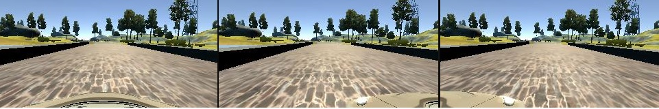

# Behavioral-Cloning ([demo](https://youtu.be/-gZGYOtfjZ4))
An implementation of "[End-to-end learning for self-driving cars](http://images.nvidia.com/content/tegra/automotive/images/2016/solutions/pdf/end-to-end-dl-using-px.pdf)" paper.
---
## Files
Important files:
* model.py contains the script to create and train the keras model
* helpers.py some functions used to load and preprocess data
* drive.py for driving the car in autonomous mode
* model.h5 contains a trained convolution neural network 
* writeup_report.md a report summarizing the results   
---
## Model architecture
We follow the model described in this [paper](http://images.nvidia.com/content/tegra/automotive/images/2016/solutions/pdf/end-to-end-dl-using-px.pdf) (see section 5). The model consists of five convolutional layers and three fully connected layers. In addition to these layers, a normalization layer is included at the input side of the model, so that the normalization is accelerated with GPU processing.
The core layers are:  
1. A normalization layer (which is a fixed transformation of the input)
2. A croppying layer (to remove uppper part of the images)
3. A convolutional layer with a 5x5 filter, 2x2 strides, depth = 24
4. A convolutional layer with a 5x5 filter, 2x2 strides, depth = 36
5. A convolutional layer with a 5x5 filter, 2x2 strides, depth = 48
6. A convolutional layer with a 3x3 filter, non-strided, depth = 64
7. A convolutional layer with a 3x3 filter, non-strided, depth = 64
8. A flattening layer that connects the previous layer to 1164 neurons
9. A fully connected layer with output dimension=100x1
10. A fully connected layer with output dimension=50x1
11. A fully connected layer with output dimension=10x1
12. A fully connected layer with output dimension=1x1 (steering angle float)  
  
This model is implemented using keras with tensorflow backend. This is included in model.py. The resulting model has around 250 thousand parameters.

---
## Generating Data
Generating proper data is the core of this project. In this section I provide my approach to collect training examples. I also highlight some mistakes that I made.

Data collectoin procedure:
1. Use the original data provided with the project. Looking at the values of the steering angles of this data shows that keyboard controls are used (lots of zeros).
2. Generate smoother data using mouse or joystick (I used mouse).
3. Driving very close to the center: at least two laps on the counter clockwise (default direction), and one lap clockwise.
4. Select around 10 places on the track. Start recording while in a bad orientaion of the car. Record how you get back to the center of the lane. At least 5 of these placers should be at hard the turns. Also, try to start recording near the boundaries. This will significantly improve the model.
5. Drive one lap in the mountain track to help the model generalize. This is very imoprtant to help the model recover from bad orientations.
6. Make use of the left and right images generated by the side cameras. Make sure to correct the measuremnts of these readings. We use a correction factor of 0.2 (+0.2 for left image, -0.2 for the right one).In fact, wihtout using these images, the model won't be able to drive back to lane properly, unless you collect a huge amount of data (which will result in memorizing the map, and we dont wont to do this). 
7. Augment the data by flipping all the images. Also flip the measurements by multiplying with -1.

Mistakes to avoid:  
1. While trying to collect recovery data, i.e. training exmaples of your car recovering from a bad turn, start recording while recovering. In other words, do not record the part where you intentionally drive the car to the boundaries.
2. Avoid corrolating the training data with the tests that you make, which I think is the greatest challenge of this project. For example, assume you trained the model on a certain data set. While testing your model, you see that the car tends to go right near the bridge. To correct this error, a faulty approach is to go to the same place and record multiple prefectly executed trials. By doing so, the car will probably pass this checkpoint, but only because it memorized it. In other words, it is like you are training on the test set. Ofcourse, the loss will go down, but the model will not generalize. To avoid this pitfall, try to drive the car manually slightly after the point where the car fails, and let it continue autonomously. This way will recognize most of the mistakes the car is making. Then randomly select some places around the map to add some recovery data that you think was missing.
3. Avoid collecting very large amounts of data. The model will easily memorize the track. I presonally challenged myself to collect the minimum ammount of data. Ultimately, we want to minimize the generalization error, not the training error.
---
## Training the model
Important notes for training:
1. 80% of the data is used for training, 20% for validation
2. The data is shuffled
3. adam optimizer is used
4. The optimizer minimizes the mean square error of the output
5. We train for 4 epochs. Anything beyond 4 epochs still decreases the training error, but the validation error either platoes or increases. Hence we limit to 4 epochs to avoid overfitting.
6. The final size of augmented data is about 22 GB. For some machines, this data cannot be loaded directly to memory. Alternatively, generators should be used to load data in smaller batches. 
7. It takes around 7 minutes to train this model with 88686 training examples. Hardware used: NVIDIA GTX 1080 ti, Intel core i7 7700K, 32 GB RAM

